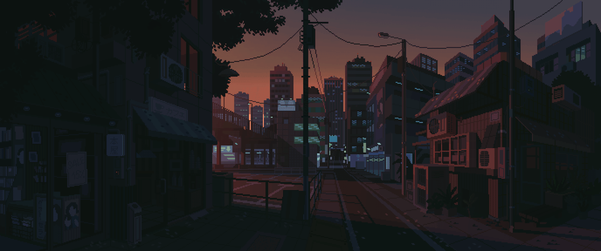

```bash

 █████╗ ███╗   ██╗██╗███████╗██╗ ██████╗  ██████╗ ██████╗ ██████╗ ███████╗
██╔══██╗████╗  ██║██║██╔════╝██║██╔═══██╗██╔════╝██╔═══██╗██╔══██╗██╔════╝
███████║██╔██╗ ██║██║███████╗██║██║   ██║██║     ██║   ██║██║  ██║█████╗
██╔══██║██║╚██╗██║██║╚════██║██║██║   ██║██║     ██║   ██║██║  ██║██╔══╝
██║  ██║██║ ╚████║██║███████║██║╚██████╔╝╚██████╗╚██████╔╝██████╔╝███████╗
╚═╝  ╚═╝╚═╝  ╚═══╝╚═╝╚══════╝╚═╝ ╚═════╝  ╚═════╝ ╚═════╝ ╚═════╝ ╚══════╝

```


# Hi there 

I'm **Anisio Nkula**, a passionate developer and tech enthusiast. I love exploring new technologies, building projects, and sharing my knowledge with the community. This space is where I document my learning journey, showcase my projects, and connect with like-minded individuals.

[](https://www.x.com/anisiocode) [](https://instagram.com/anisiocode) [](https://www.linkedin.com/in/anisiocode/) [](https://medium.com/@anisiocode) [](https://www.youtube.com/watch?v=U14GpQ5K03g&t=952s) [](https://github.com/anisiocode) [](https://www.buymeacoffee.com/anisiocode) [](https://anisionkula.vercel.app) [](mailto:anisiocode@gmail.com) [](https://www.pinterest.com/anisiocode/) [](#) [](https://stackoverflow.com/users/31339192/anisiocode)

<!-- []() []() []() []() []() []() []() []() []() []() []() []() []() []() []() []() []() []() []() []() []() []() []() []() []() []() []() []() []() []() []() []() []() []() []() []() []() []() []() []() []() []() []() []() []() []() []() []() []() []() []() []() []() []() []() -->

<div align="center">

[](https://skillicons.dev)

</div>

<details>
<summary>GitHub Stats</summary>
<div align="center">

[]()
[]()
[]()
[]()
[]()
[]()
[]()

[]()
[]()
[]()

</div>
</details>

<div align="center">



</div>
